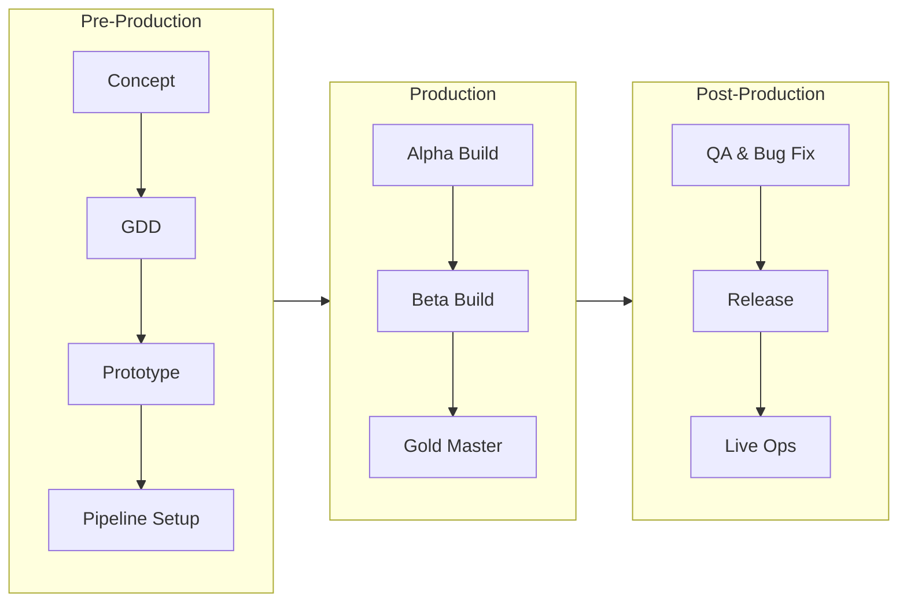

```mermaid
```mermaid
mindmap
root((Pac-Man))
Theme
เขาวงกต
อาเขตยุค 80
Mechanics
เดินในเขาวงกต
กิน Pellet
Power Pellet
Content
ผีศัตรู 4 ตัว
ผลไม้โบนัส
Audience
ผู้เล่น Casual
```sequenceDiagram
participant PO as Producer
participant Team as Dev Team
participant QA
PO->>Team: Sprint Planning
loop Sprint (2 weeks)
Team->>Team: Daily Work
Team->>QA: Build for Testing
QA-->>Team: Bug Report
end
Team->>PO: Sprint Review
PO->>Team: Retrospective
```
